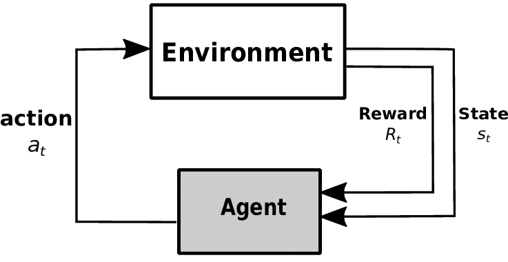
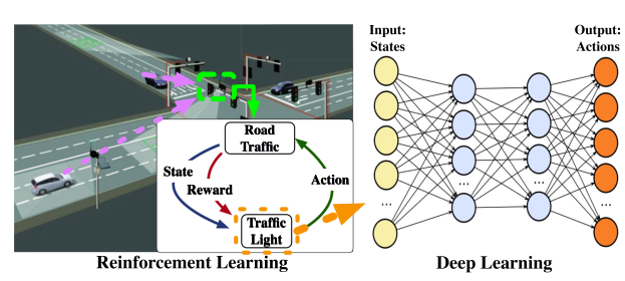
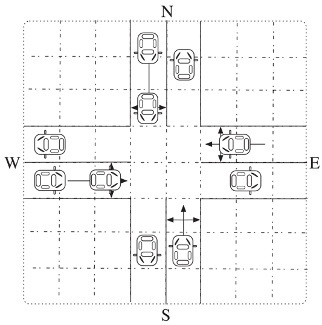
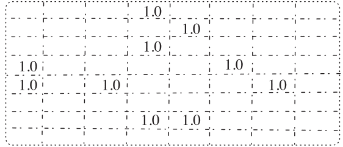
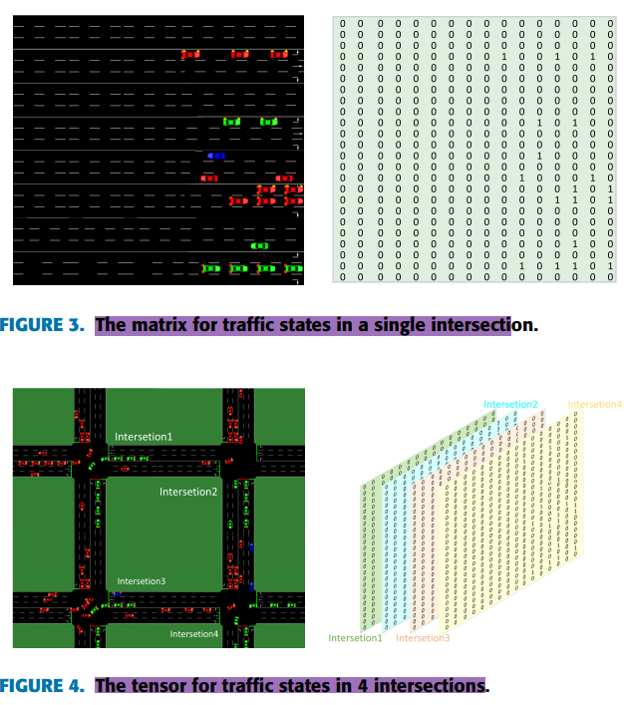
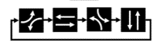
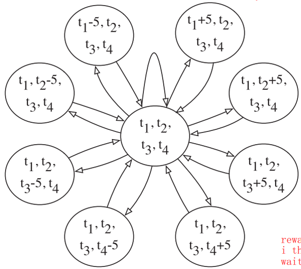
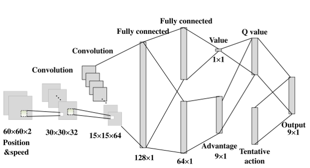
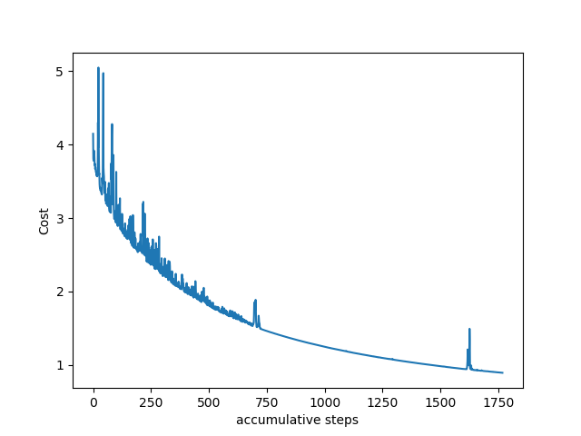

# NoisyNet Double Dueling Prioritized Experience Replay DQN (NP3DQN) on signal
NoisyNet + Double + Dueling + Prioritized Experience Replay + DQN (NP3DQN) on trafiic signal timing plan optimization, it can be used in an adaptive traffic control algorithm whereaa Dynamic Intersection Signal Control Optimisation (DISCO) as the virtual testbed on messo-simulation packages

## Basic reinforcement learning workflow
 

## Reinforcement learning usecase in traffic signal
 

## States input
 
 
 

## Action space
 
 

## Neural_network_architecture
 

## Cost vs accumulative steps
 

## Reference
[a deep reinforcement learning network for traffic light cycle control](https://ieeexplore.ieee.org/document/8600382) 
[An agent-based learning towards decentralized and coordinated traffic signal control](https://ieeexplore.ieee.org/document/5625066) 
[Cooperative_Control_for_Multi-Intersection_Traffic_Signal_Based_on_Deep_Reinforcement_Learning_and_Imitation_Learning](https://ieeexplore.ieee.org/document/9241814) 
[Decentralized network level adaptive signal control by multi-agent deep reinforcement learning](https://www.sciencedirect.com/science/article/pii/S259019821930020X) 
[Deep_Reinforcement_Learning_based_Traffic_Signal_optimization_for_Multiple_Intersections_in_ITS](https://ieeexplore.ieee.org/document/9342819) 
[Multi-Agent Deep Reinforcement Learning for Large-scale Traffic Signal Control](https://arxiv.org/abs/1903.04527) 
[Traffic light Control Using Deep Policy-Gradient and Value-Function Based Reinforcement learning](https://arxiv.org/abs/1704.08883) 
[Traffic Signal Control with Cell Transmission Model Using Reinforcement Learning for Total Delay Minimisation](https://www.researchgate.net/publication/281190474_Traffic_Signal_Control_with_Cell_Transmission_Model_Using_Reinforcement_Learning_for_Total_Delay_Minimisation) 
[Traffic Signal Optimization for Multiple Intersections Based on Reinforcement Learning](https://www.mdpi.com/2076-3417/11/22/10688) 
[A cold-start-free reinforcement learning approach for traffic signal control ](https://www.sciencedirect.com/org/science/article/abs/pii/S1547245022003759) 
[NOISY NETWORKS FOR EXPLORATION](https://arxiv.org/abs/1706.10295) 
